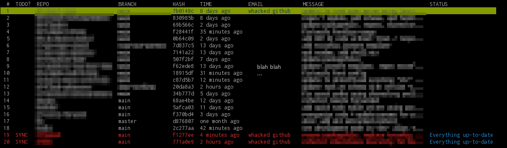

# repollector

a tool to run git pull+push against several repositories at the same time



# usage (at your own risk)

```sh
go run cmd/repollector/main.go <target-directory>
```

`repollector` will then recursively search for repository candidates from `target-directory`

if `<target-directory>` is not supplied it will default to the current directory to start.

it tries to detect if the local repo is ahead of the remote repo. Those that are ahead get marked as `SYNC` in the table.

Once it finds repositories it will present them in a table. There's not much to do aside of hitting `ENTER`, which then executes

```sh
cd <repo-directory>
git pull --rebase --autostash 2>&1
git push origin <current-branch>
```

against all repos marked as `SYNC`

Not really a go programmer, but doing this in bash becomes a different kind of mess, so here we are. Again, use at your own risk.
